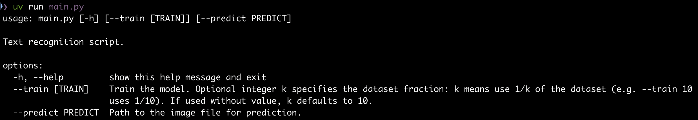
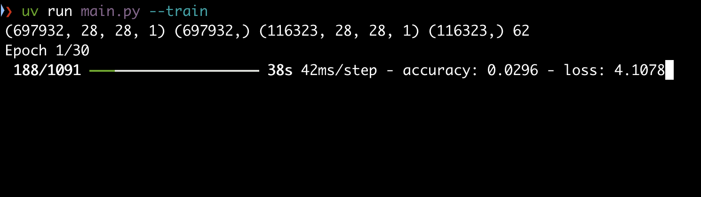

# Text Recognition with EMNIST

This project implements a text recognition system using the EMNIST dataset and a Convolutional Neural Network (CNN) built with Keras. The system can train a model to recognize handwritten characters and predict text from images.

## Features
- Train a CNN model on the EMNIST dataset.
- Predict handwritten text from input images.
- Preprocess and extract individual characters from images.

## Screenshots

### Main 


### Training Process


## Requirements
- Python 3.13
- `uv` package manager

## Installation
1. Clone the repository:

2. Install the required dependencies using `uv`:
   ```bash
   uv sync
   ```

## Usage

### Training the Model
To train the model on the EMNIST dataset (10 means 1/10 of the dataset), run:
```bash
uv run main.py --train 10
```

### Predicting Text
To predict text from an image, run:
```bash
uv run main.py --predict <path-to-image>
```
Replace `<path-to-image>` with the path to your input image.

### Dataset
The EMNIST dataset files should be placed in the `data/` directory. Ensure the following files are present:
- `emnist-byclass-train-images-idx3-ubyte`
- `emnist-byclass-train-labels-idx1-ubyte`
- `emnist-byclass-test-images-idx3-ubyte`
- `emnist-byclass-test-labels-idx1-ubyte`

## Project Structure
- `main.py`: Entry point for training and prediction.
- `model.py`: Contains the CNN model and training logic.
- `emnist.py`: Utility functions for handling the EMNIST dataset.
- `data/`: Directory for storing the EMNIST dataset files.
- `text.png`: Example input image for prediction.

## Acknowledgments
- [EMNIST Dataset](https://www.nist.gov/itl/products-and-services/emnist-dataset): Provided by the National Institute of Standards and Technology (NIST).